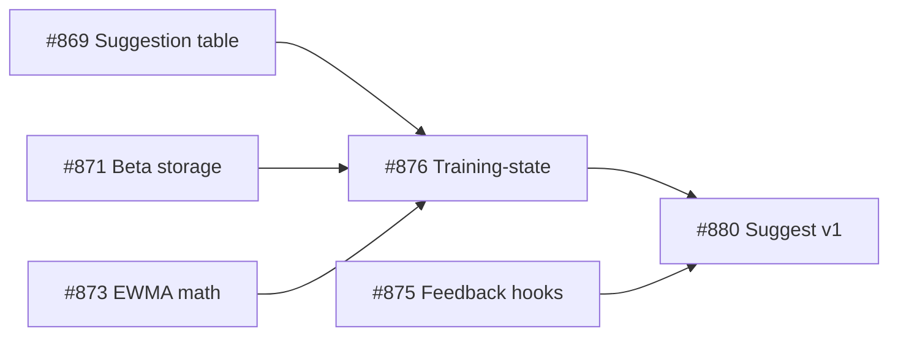

# ms-visualizer (`msv`)

CLI for tracking a complex GitHub milestone: issue/PR burn-down + dependency-graph overlay.

## Install

```bash
cd ~/repos/ms-visualizer
go build -o msv ./cmd/msv
# put on PATH:
sudo mv msv /usr/local/bin/
```

## Auth

Uses `GITHUB_TOKEN` if set, otherwise falls back to `gh auth token`.

## Commands

### `msv status <owner>/<repo> --milestone <name-or-number>`

Renders a table of every issue in the milestone: state, tracked labels
(`needs-review`, `blocked`, `agent-ready`, `autopilot`, `in-progress`, `bug`,
`spike`, `ux`, `design`, `no-agent`), and the PR(s) linked to it via
**either** `Fixes #N` in the PR body **or** the `agent/issue-N` branch name.

Flags a **⚠mismatch** when the PR body says `Fixes #A` but the branch is
`agent/issue-B`. That happened once in the Ripit fitness milestone and it
was the highest-value signal to catch.

Also prints "Unlinked open PRs" — anything without an issue in the branch
or a Fixes ref.

Example:

```
msv status aptx-health/ripit-fitness -m "Suggest Workout (LLM-powered)"
```

### `msv graph <owner>/<repo> --milestone <name-or-number> [--file docs/milestones/15.md]`

Reads a Mermaid flowchart from a markdown file (either bracketed between
`<!-- deps:start -->` / `<!-- deps:end -->` sentinels, or the first
` ```mermaid ` fence), parses it into a dependency graph, and overlays
live GH state per node.

If `--file` is omitted, reads from stdin (pipe a discussion body in).

Glyph legend:
- `●` merged / closed done
- `◑` PR open
- `◐` PR draft
- `○` open, no PR yet

### `msv ready <owner>/<repo> --milestone <name-or-number> [--json]`

Lists open, unclaimed issues whose graph dependencies are done, including
tracked labels in text output and `labels` in JSON. Use `--label <name>` to
restrict results to matching labels, and repeat `--exclude-label <name>` to
omit labels such as `no-agent`:

```bash
msv ready aptx-health/milestone-visualizer -m "v2-fan-in" --exclude-label no-agent --json
```

## Dependency-graph format

Standard Mermaid the whole team can read on GitHub. Nodes are keyed by
issue number, edges are dependency ("A must land before B"):

````markdown
<!-- deps:start -->

<!-- deps:end -->
````

Store this in `docs/milestones/<milestone-number>.md` (or wherever) and
link from the milestone discussion. Any agent can rewrite the block
between the sentinels; humans get a rendered diagram on GitHub for free.

### `msv graph-edit fmt [--file docs/milestones/15.md] [--check]`

Rewrites the Mermaid block in **canonical form** — all nodes declared
first (sorted by number), then bare edges (sorted) — without changing
anything semantically. Run it after hand-editing a graph doc so your
first real `graph-edit` mutation produces a clean, minimal diff instead
of a whole-block rewrite.

- Exits `0` whether or not the file changed.
- `--check` leaves the file untouched and exits non-zero (`2`) when the
  doc is not already canonical — suitable for a CI gate.

Other `graph-edit` subcommands (`add-edge`, `rm-edge`, `add-node`,
`rm-node`) mutate the graph and always write it back canonically.

## Notes

- Multiple agents on a milestone at once: `status` groups PRs under their
  claimed issue and surfaces label state, so you can spot "two PRs targeting
  the same issue" and "issue with `blocked` label" at a glance.
- Branch-name-vs-Fixes mismatch check is the escape hatch for the
  autopilot mislabel class of bug.
