# v1-tablestakes — bootstrap: agent infra, CI, skill, hygiene

Dependency graph. Any agent may rewrite the block between the sentinels below.

Edges from #3 reflect agent-executability: until agent-minder is enrolled,
nothing routes these issues to agents.

```mermaid
flowchart LR
  1[#1 doctor: dedupe pr-issue-mismatch]
  3[#3 Enroll agent-minder]
  4[#4 msv agent skill]
  5[#5 GitHub Actions CI]
  17[#17 graph-edit fmt]
  23[#23 ready: labels + no-agent filter]
  24[#24 branch linkage regex]
  35[#35 msv milestones list]
  3 --> 1
  3 --> 5
  3 --> 17
```

<!-- deps:start -->

<!-- deps:end -->
