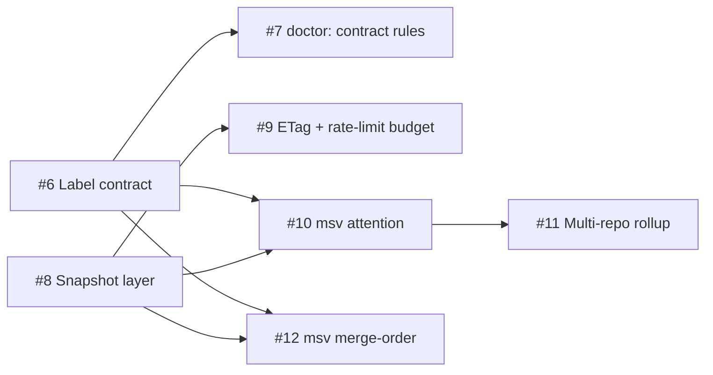

# v2-fan-in — label contract, snapshot layer, human work queue

Dependency graph. Any agent may rewrite the block between the sentinels below.

<!-- deps:start -->

```mermaid
flowchart LR
  6[#6 Label contract] --> 7[#7 doctor: contract rules]
  6 --> 10[#10 msv attention]
  6 --> 12[#12 msv merge-order]
  8[#8 Snapshot layer] --> 9[#9 ETag + rate-limit budget]
  8 --> 10
  8 --> 12
  10 --> 11[#11 Multi-repo rollup]
```
<!-- deps:end -->
