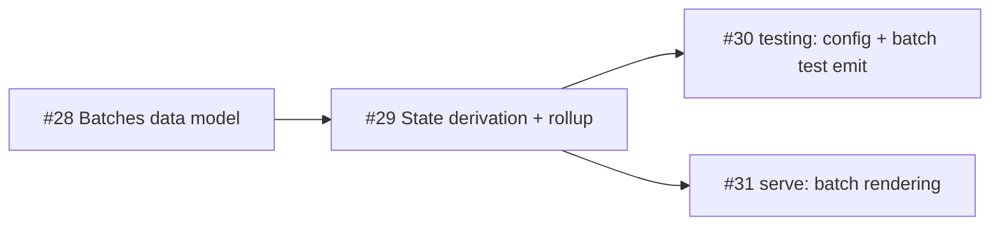

# v4-batches — authored issue sets with derived state (spec: #27)

Dependency graph. Any agent may rewrite the block between the sentinels below.

Cross-milestone: state derivation gates on #6 (label contract); test emission
composes with #12 (merge-order); web rendering needs #13 (serve).

<!-- deps:start -->

<!-- deps:end -->
