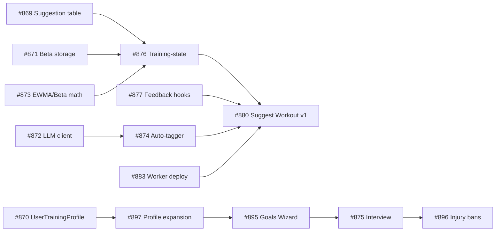

# Milestone 15 — Suggest Workout (LLM-powered)

Dependency graph. Any agent may rewrite the block between the sentinels below.

<!-- deps:start -->

```mermaid
flowchart LR
  872[#872 LLM client] --> 874[#874 Auto-tagger]
  870[#870 UserTrainingProfile] --> 897[#897 Profile expansion]
  897 --> 895[#895 Goals Wizard]
  895 --> 875[#875 Interview]
  875 --> 896[#896 Injury bans]
  869[#869 Suggestion table] --> 876[#876 Training-state]
  871[#871 Beta storage] --> 876
  873[#873 EWMA/Beta math] --> 876
  876 --> 880[#880 Suggest Workout v1]
  877[#877 Feedback hooks] --> 880
  874 --> 880
  883[#883 Worker deploy] --> 880
```
<!-- deps:end -->
